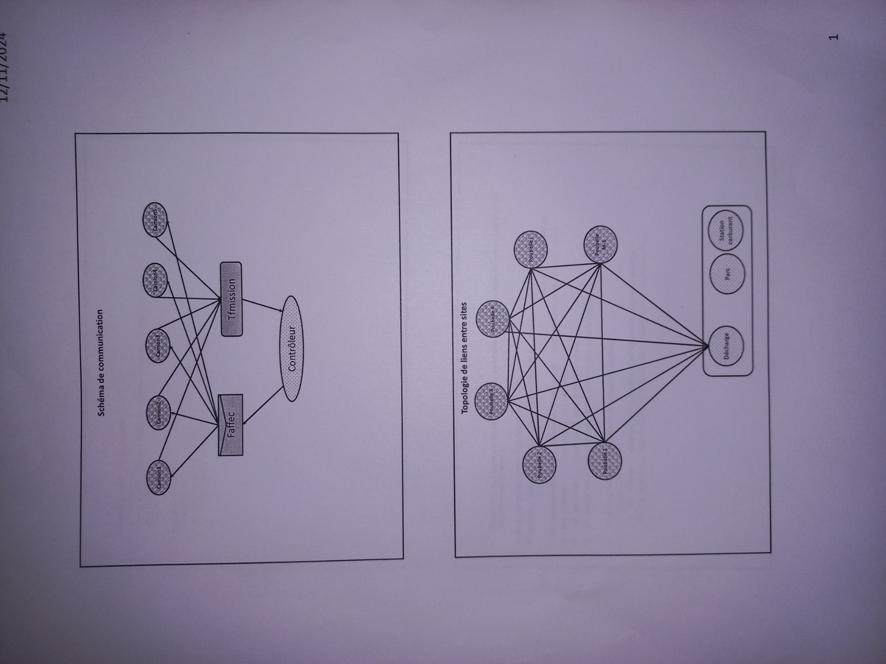

# TP3
## Resume
 * N processus camions
    * Etats: 
      1. en_mission
      2. en_repos
      3. en_ravetaillement
      4. pret_pour_programme
 * M poubelles
   * Etats:
     1. vide
     2. pleine
     3. en_decharge
 * processus controlleur
 * Pere cree les processus fils
## Structures de donnees:
### A. Constantes:
  1. Dist_poubelles (M*M) entre poubelles
  2. Dist_decharge (M) entre chaque poubelles et le depos
### B. Temps Reel:   
  1. Etats des camions:
     * id_camion
     * d
  2. Etats des poubelles:
     * d
## Structures de comm (crees par le pere) :
 * Tampon 
 * File de messages
